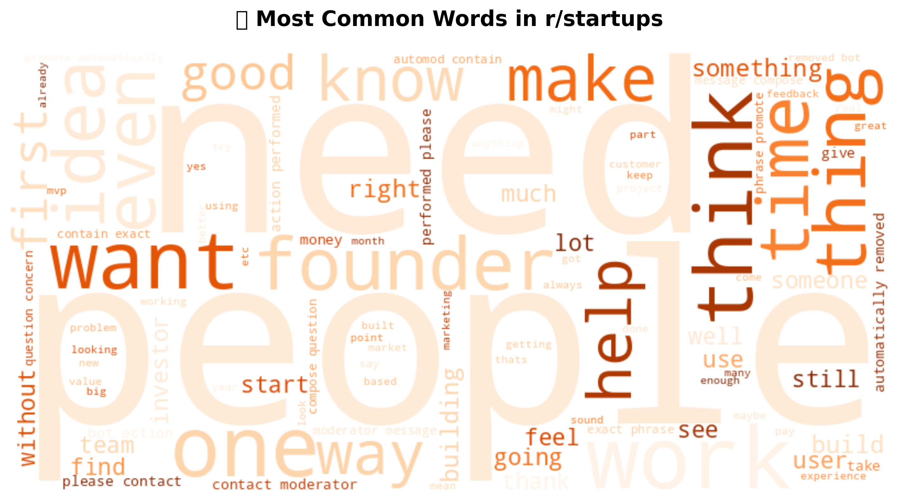

# 🚀 Reddit Sentiment & Topic Co-evolution Tracker

A comprehensive data science project analyzing sentiment patterns and topic evolution across multiple Reddit communities using advanced NLP techniques, sentiment analysis, and interactive visualizations.

*Note: Add project banner image to outputs folder*

---

## 📊 Project Overview

This project demonstrates advanced data science capabilities by analyzing **53,722 comments** from 5 diverse Reddit communities over a 3-month period (March–June 2025). Using state-of-the-art NLP techniques, we uncover fascinating insights about community cultures, sentiment patterns, and topic evolution.

### 🎯 Key Features

- **Multi-Community Analysis**: 5 diverse subreddits (`r/technology`, `r/startups`, `r/pathofexile`, `r/factorio`, `r/happy`)
- **Advanced NLP**: BERTopic for semantic topic modeling, VADER for sentiment analysis
- **Interactive Visualizations**: Plotly dashboards, word clouds, temporal analysis
- **Comprehensive Insights**: 65 unique topics, detailed sentiment profiling
- **Production-Ready**: Streamlit dashboard for interactive exploration

---

## 📈 Key Findings

### Community Sentiment Profiles

| Community      | Avg Sentiment | Positive % | Negative % | Cultural Characteristics           |
|----------------|---------------|------------|------------|------------------------------------|
| r/happy        | **0.609**     | 85.0%      | 5.3%       | Exceptionally positive, gratitude-focused |
| r/startups     | **0.374**     | 70.1%      | 15.8%      | Optimistic, entrepreneurial enthusiasm |
| r/factorio     | **0.210**     | 54.3%      | 21.1%      | Constructive gaming community      |
| r/pathofexile  | **0.162**     | 51.2%      | 25.5%      | Balanced gaming discourse          |
| r/technology   | **0.027**     | 39.8%      | 34.7%      | Critical, analytical discussions   |

### Topic Distribution

*Top 15 discussion topics across all communities*

---

## 🔍 Visualizations

### Sentiment Analysis

### Word Clouds

| r/technology | r/startups |
|:------------:|:----------:|
|  |  |

| r/pathofexile | r/factorio |
|:-------------:|:----------:|
|  |  |

### Temporal Trends

<!--  -->

---

## 🛠️ Technical Architecture

### Data Pipeline

Reddit API → Text Preprocessing → Sentiment Analysis → Topic Modeling → Visualization  
**Stack**: `PRAW → NLTK/spaCy → VADER → BERTopic → Plotly/Streamlit`

### Tech Stack

- **Data Collection**: PRAW (Reddit API)
- **Text Processing**: NLTK, spaCy, regex
- **ML Models**: BERTopic, sentence-transformers, scikit-learn
- **Sentiment**: VADER
- **Visualization**: Plotly, WordCloud, Matplotlib
- **Dashboard**: Streamlit
- **Data Management**: Pandas, NumPy

---

